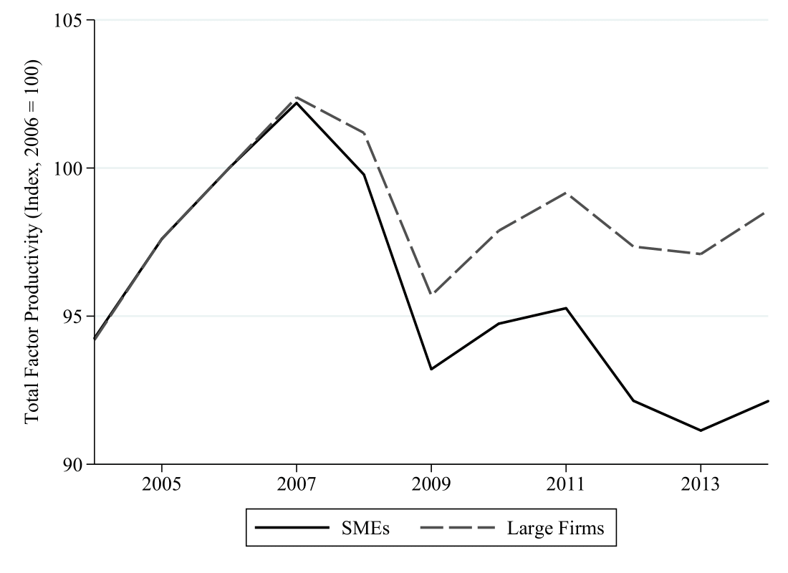
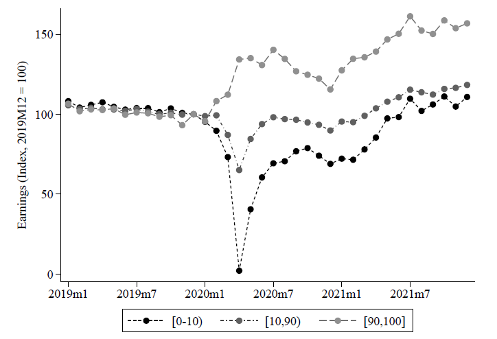

I am a Ph.D. candidate in Economics at New York University (NYU). \
Research Interests: Macroeconomics, Asset Pricing, Labor Economics \
Email: [dql204@nyu.edu](mailto:dql204@nyu.edu) 

[**CV**](../files/CV_Do_Lee.pdf)
  

Education
=========
---
* Ph.D. in Economics, New York University, 2026 (Expected)
* B.A. in Economics and B.S. in Mathematics, University of Chicago, 2017  

 

Job Market Paper
=========
---
**Belief Distortions and Unemployment Fluctuations** \
<a href="#/" onclick="visib('BDUF')">Abstract</a> [PDF](../files/main.pdf)  

This paper studies the joint dynamics of asset prices and unemployment when expectations deviate from a rational benchmark. I decompose firms' hiring decisions into expected future cash flows and discount rates, both in the aggregate market (U.S. job filling rate) and the cross section (firm hiring rate). Under subjective beliefs implied by survey forecasts, hiring is driven by predictable errors in expected cash flows, while discount rates play a limited role. In contrast, rational expectations assign a dominant role to discount rates, suggesting that subjective beliefs overestimate the importance of cash flows. A search and matching model in which agents learn with fading memory about stock prices and cash flows can reproduce these patterns and generate realistic unemployment volatility. 
  

 

Publications
=========
---
**Media Sentiment and International Asset Prices** \
(with [Samuel Fraiberger](https://www.samuelfraiberger.com/), [Damien Puy](https://sites.google.com/view/damienpuy), and [Romain Ranciere](https://rranciere.academia.edu/)) \
*Journal of International Economics*, 2021, 133(C): 103526 \
<a href="#/" onclick="visib('FLPR2021')">Abstract</a> [PDF](../files/mediaSentiment.pdf) [DOI](https://doi.org/10.1016/j.jinteco.2021.103526) [Working Paper](https://www.nber.org/papers/w25353) [Code and Data](https://doi.org/10.7910/DVN/QNKFJF) \
Media: [IMF Blog](https://www.imf.org/en/Blogs/Articles/2019/12/16/blog-the-power-of-text) [IMF Research Perspectives](https://www.imf.org/-/media/Files/Research/research-perspective/2019/SpringSummer/index.ashx) 

We investigate the relationship between media sentiment and international equity prices using a new dataset of 4 million news articles published between 1991 and 2015. Three key results emerge. First, news sentiment robustly predicts future daily returns around the world. However, we find a sharp contrast between the effect of local news and that of global news: whereas local news optimism (pessimism) predicts a small and transitory increase (decrease) in local equity returns, global news sentiment has a larger impact on returns that does not reverse in the short run. Second, news sentiment affects local prices mainly through the investment decisions of foreign—rather than local—investors. Third, large variations in global news sentiment predominantly happen in the absence of new information about fundamentals, suggesting that movements in global sentiment capture variations in investors' sentiment. Taken together, our findings illustrate the key role played by foreign news and investors' sentiment in driving local asset prices.
  

**Demand Conditions and Worker Safety: Evidence from Price Shocks in Mining** \
(with [Kerwin Charles](https://faculty.som.yale.edu/kerwincharles/), [Matthew Johnson](https://sites.google.com/site/mslaterjohnson/home?authuser=0), and [Mel Stephens](https://sites.lsa.umich.edu/mstep/)) \
*Journal of Labor Economics*, 2022, 40(1): 47-94 \
<a href="#/" onclick="visib('CJLS2022')">Abstract</a> [PDF](../files/Mining.pdf) [DOI](https://doi.org/10.1086/713887) [Working Paper](https://www.nber.org/papers/w26401) [Code and Data](https://github.com/doqlee/mining) \
Media: [Yale Insights](https://insights.som.yale.edu/insights/firms-sacrifice-worker-safety-when-demand-is-high) 

We investigate how demand conditions affect employers' provision of safety—something about which theory is ambivalent. Positive demand shocks relax financial constraints that limit safety investment but simultaneously raise the opportunity cost of increasing safety rather than production. We study the US metals mining sector, leveraging exogenous demand shocks from short-term variation in global commodity prices. We find that positive price shocks substantially increase workplace injury rates and safety regulation noncompliance. While these results indicate the general dominance of the opportunity cost effect, shocks that only increase mines' cash flow lower injury rates, illustrating that financial constraints also affect safety.
  

**Small and Vulnerable: Small Firm Productivity in the Great Productivity Slowdown** \
(with [Sophia Chen](https://sites.google.com/site/sophiachenecon/home)) \
*Journal of Financial Economics*, 2023, 147(1): 49-74 \
<a href="#/" onclick="visib('CL2023')">Abstract</a> [PDF](../files/SmallAndVulnerable.pdf) [DOI](https://doi.org/10.1016/j.jfineco.2022.09.007) [Working Paper](https://doi.org/10.5089/9781513564647.001) [Code and Data](https://doi.org/10.17632/49wv286my4.1)

We show that the TFP growth of European micro, small, and medium-sized firms (SMEs) diverged from large firms after the global financial crisis. The average post-crisis TFP growth of medium-sized, small, and micro firms was, respectively, 1.1, 2.9, and 5.4 percentage points lower than that of large firms. This SME productivity gap is larger for firms with more severe credit supply shocks. The gap is partially attributable to a larger post-crisis reduction in intangible capital at SMEs than at large firms. Horseraces suggest that SME indicators are more robust and more powerful predictors of post-crisis TFP growth than other indicators.
  

 

Working Papers
=========
---

**Zombies on the Brink: Evidence from Japan on the Reversal of Monetary Policy Effectiveness** \
(with [Gee Hee Hong](https://sites.google.com/site/geeheehong/home) and [Deniz Igan](https://www.imf.org/en/Research/Researcher-CV/Author/Igan-Deniz?AuthID=163#Background)) \
BIS Working Paper No. 987, 2022 \
<a href="#/" onclick="visib('HIL2022')">Abstract</a> [PDF](../files/Japan.pdf) [Working Paper](https://www.bis.org/publ/work987.htm)

How does unconventional monetary policy affect corporate capital structure and investment decisions? We study the transmission channel of quantitative easing and its potential diminishing returns on investment from a corporate finance perspective. Using a rich bank-firm matched data of Japanese firms with information on corporate debt and investment, we study how firms adjust their capital structure in response to the changes in term premia. Investment responds positively to a reduction in the term premium on average. However, there is a significant degree of cross-sectional variation in firm response: healthier firms increase capital spending and cash holdings, while financially vulnerable firms take advantage of lower long-term yields to refinance without increasing investment.
  

**Inflation and Labor Markets: A Bottom-Up View** \
(with [Sophia Chen](https://sites.google.com/site/sophiachenecon/home), [Deniz Igan](https://www.imf.org/en/Research/Researcher-CV/Author/Igan-Deniz?AuthID=163#Background), and [Prachi Mishra](https://prachimishra.in/)) \
IMF Working Paper No. 220, 2024 \
<a href="#/" onclick="visib('CILM2024')">Abstract</a> [PDF](../files/HomebaseInflation.pdf) [Working Paper](https://doi.org/10.5089/9798400291807.001)

U.S. inflation surged in 2021-22 and has since declined, driven largely by a sharp drop in goods inflation, though services inflation remains elevated. This paper zooms into services inflation, using proprietary microdata on wages to examine its relationship with service sector wage growth at the Metropolitan Statistical Area (MSA) level. We estimate the wage-price pass-through with a local projection instrumental variable model that exploits variation in labor market tightness across MSAs. Our findings reveal a positive and significant relationship between wages and price growth, with a lag. This suggests that the effects of tight labor markets are persistent and may influence the pace of progression toward the inflation target.
  

**Divergence in Post-Pandemic Earnings Growth: Evidence from Micro Data** \
(with [Sophia Chen](https://sites.google.com/site/sophiachenecon/home)) \
IMF Working Paper No. 222, 2024 \
<a href="#/" onclick="visib('CL2024')">Abstract</a> [PDF](../files/HB_analysis.pdf) [Working Paper](https://doi.org/10.5089/9798400291814.001)

We analyze post-pandemic labor earnings using employer-employee data and find that earnings grew faster in counties with tighter labor markets and with greater access to loans through the Paycheck Protection Program (PPP), with the impact of PPP loans especially pronounced in areas with tighter labor markets. This divergence in earnings growth is particularly large for lower-paid, nonmanagerial workers, and those employed in smaller firms. Both wage increases and additional hours worked contributed to the overall growth in earnings. These findings align with a labor market competition framework, where tight labor markets reduce earnings disparities. Access to credit further strengthens the competition by relaxing firms’ financing constraints.
  

**280 Characters to Employment: Using Twitter to Quantify Job Vacancies** \
(with [Boris Sobol](https://scholar.google.com/citations?user=LyWADs0AAAAJ&hl=en), [Manuel Tonneau](https://manueltonneau.com/), [Samuel Fraiberger](https://www.samuelfraiberger.com/), and [Nir Grinberg](https://cris.bgu.ac.il/en/persons/nir-grinberg)) \
*Proceedings of the International AAAI Conference on Web and Social Media*, 2024, 18(1), 1477-1489 \
<a href="#/" onclick="visib('STFGL2024')">Abstract</a> [PDF](../files/job_offers_twitter_icwsm_2023.pdf) [DOI](https://doi.org/10.1609/icwsm.v18i1.31403) [Code and Data](https://github.com/Socially-Embedded-Lab/twitter-job-postings)

Accurate assessment of workforce needs is critical for designing well-informed economic policy and improving market efficiency. While surveys are the gold standard for estimating when and where workers are needed, they also have important limitations, most notably their substantial costs, dependence on existing and extensive surveying infrastructure, and limited temporal, geographical, and sectorial resolution. Here, we investigate the potential of social media to provide a complementary signal for estimating labor market demand. We introduce a novel statistical approach for extracting information about the location and occupation advertised in job vacancies posted on Twitter. We then construct an aggregate index of labor market demand by occupational class in every major U.S. city from 2015 to 2022, which we evaluate against two sources of official statistics and an index from a large aggregator of online job postings. We find that the newly constructed index is strongly correlated with official statistics and, in some cases, advantageous compared to statistics from job aggregators. Moreover, we demonstrate that our index can robustly improve the prediction of official statistics across occupations and states.
  

**Can Social Media Reliably Estimate Unemployment?** \
(with [Samuel Fraiberger](https://www.samuelfraiberger.com/), [Nir Grinberg](https://cris.bgu.ac.il/en/persons/nir-grinberg), [Boris Sobol](https://scholar.google.com/citations?user=LyWADs0AAAAJ&hl=en), and [Manuel Tonneau](https://manueltonneau.com/)) \
*PNAS Nexus*, Forthcoming 2025
<a href="#/" onclick="visib('FGLST2025')">Abstract</a> 

Digital trace data holds tremendous potential for measuring policy-relevant outcomes in real-time, yet its reliability is often questioned. Here, we propose a principled yet simple approach: capturing individual disclosures of unemployment using a fine-tuned artificial intelligence (AI) model and post-stratification adjustment using inferred user demographics. We show that our methodology consistently outperforms the industry's forecasting average, and can improve the predictions of U.S. unemployment insurance claims, up to two weeks in advance, at the national, state, and city levels at both turbulent and stable times. The results demonstrate the potential of combining AI models with statistical modeling to complement traditional survey methodology, and contribute to better-informed policymaking, especially at turbulent times.

 

Teaching
=========
---

**Applied Statistics & Econometrics I-II** (Master’s)  
*Teaching Assistant, NYU, 2021–2023*  
Professors: [Banani Nandi](https://www.researchgate.net/profile/Banani-Nandi), [Bruce McNevin](https://www.brucemcnevin.org/), [Elena Goldman](https://www.pace.edu/profile/elena-goldman)

**Intermediate Macroeconomics** (Undergraduate)  
*Teaching Assistant, NYU, 2020*  
Professor: [Jess Benhabib](https://sites.google.com/site/jessbenhabib/home?authuser=0)

[//]: This java script is the button to show abstract

