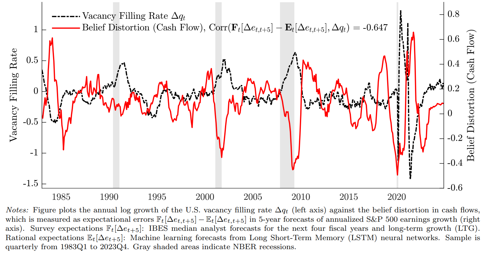

I am a Ph.D. candidate in Economics at New York University (NYU). 

Education
=========
---
* Ph.D. in Economics, New York University (expected May 2026)  
* B.A. in Economics and B.S. in Mathematics, University of Chicago, June 2017  

Job Market Paper
=========
---
**Belief Distortions and Unemployment Fluctuations**
\[<a href="#/" onclick="visib('BDUF')">Abstract</a>\] \[[PDF](../files/main.pdf)\]  

This paper studies unemployment fluctuations when expectations deviate from a rational benchmark. By using survey forecasts, I decompose time-series and cross-sectional variation in job filling rates. Under subjective beliefs, hiring is driven by predictable errors in cash flow expectations, while discount rates play a minor role. In contrast, rational expectations assign a dominant role to discount rates. Survey measures of the user cost of labor are acyclical, indicating more rigidity under subjective beliefs. The findings suggest that belief distortions can amplify unemployment fluctuations: over-optimism about cash flows during expansions leads to future disappointment, which suppresses labor demand during recessions even as perceived labor costs remain persistently high. 
 

Publications
=========
---
1. **Media Sentiment and International Asset Prices**\
(with Samuel Fraiberger, Damien Puy, and Romain Ranciere)\
*Journal of International Economics*, 2021, 133(C): 103526\  
[DOI](https://doi.org/10.1016/j.jinteco.2021.103526)\

2. **Demand Conditions and Worker Safety: Evidence from Price Shocks in Mining**\
(with Kerwin Kofi Charles, Matthew Johnson, and Melvin Stephens, Jr.)\
*Journal of Labor Economics*, 2022, 40(1): 47-94\
[DOI](https://doi.org/10.1086/713887)

3. **Small and Vulnerable: Small Firm Productivity in the Great Productivity Slowdown**\
(with Sophia Chen)\
*Journal of Financial Economics*, 2023, 147(1): 49-74\
[DOI](https://doi.org/10.1016/j.jfineco.2022.09.007)\

4. **280 Characters to Employment: Using Twitter to Quantify Job Vacancies**\
(with Boris Sobol, Manuel Tonneau, Samuel Fraiberger, and Nir Grinberg)\
*Proceedings of the International AAAI Conference on Web and Social Media*, 2024, 18(1), 1477-1489\
[DOI](https://doi.org/10.1609/icwsm.v18i1.31403)\

Working Papers
=========
---

5. **Zombies on the Brink: Evidence from Japan on the Reversal of Monetary Policy Effectiveness**\
(with Gee Hee Hong and Deniz Igan)\
[BIS Working Paper No. 987, 2022](https://www.bis.org/publ/work987.htm)\

6. **Inflation and Labor Markets: A Bottom-Up View**\
(with Sophia Chen, Deniz Igan, and Prachi Mishra)\
[IMF Working Paper No. 220, 2024](https://doi.org/10.5089/9798400291807.001)\

7. **Divergence in Post-Pandemic Earnings Growth: Evidence from Micro Data**\
(with Sophia Chen)\
[IMF Working Paper No. 222, 2024](https://doi.org/10.5089/9798400291814.001)\

8. **Can Social Media Reliably Estimate Unemployment?**\
(with Samuel Fraiberger, Nir Grinberg, Boris Sobol, and Manuel Tonneau), 2025\

Work-in-Progress
=========
---

9. **The Geography of Life Cycle Wage Growth in the United States**, 2024\

[//]: This java script is the button to show abstract

